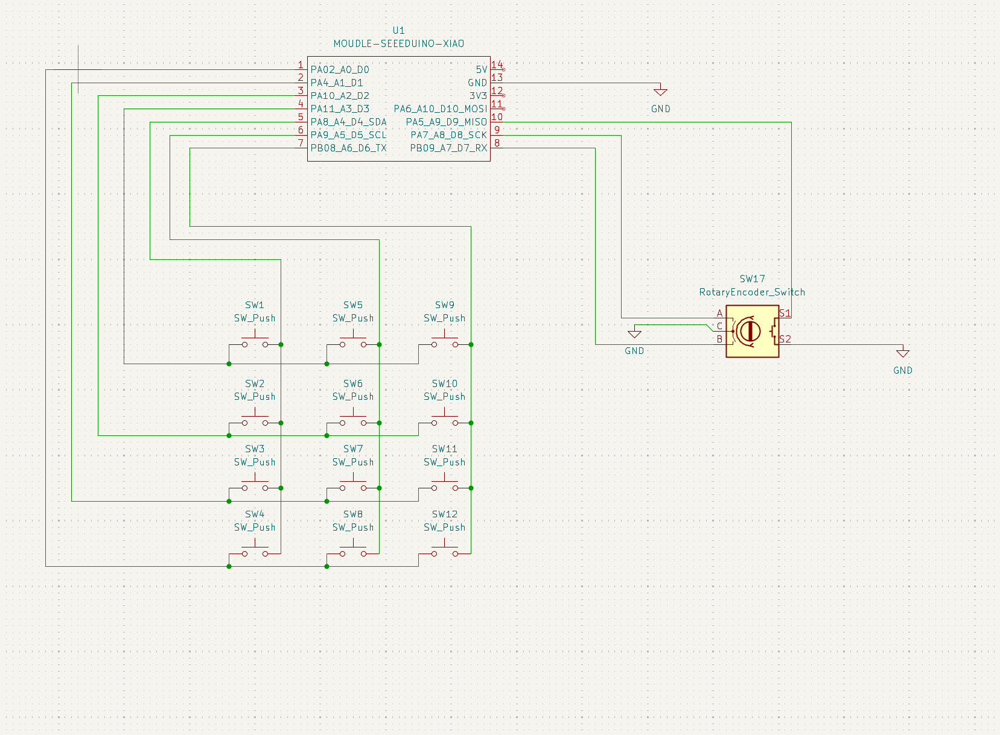
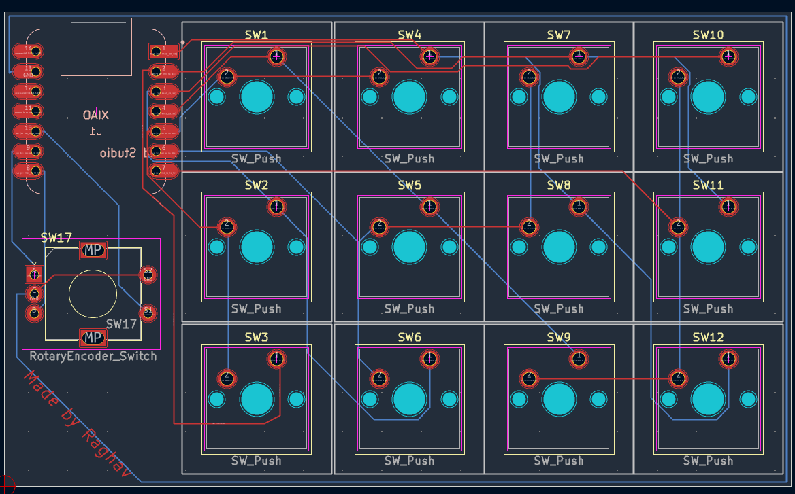

# Simhub
A custom-designed macropad for my sim-racing use, and for general purpose as well.

# Features:
* 3D - printed custom case
* 3 x 4 switch arrangement
* EC11 rotary encoder, with a switch built in
* USB-C connectivity
# CAD Model:

Everything is secured in place with 4 M3 screws and bolts, with the bolts serving a dual purpose as the base legs. The case is to be 3d-printed, along with the knob for the rotary encoder.

The render was made in Blender
The model was made in FreeCAD.

# PCB
This is the PCB, it was designed in KiCad.

Schematic 

PCB 

# Firmware
This hackpad uses QMK firmware for everything.
Since it was designed with video-game assistance in mind, you have to map all the keys in-game to use them.

*This keyboard has two modes.*

To swap between custom in-game keyboard usage and a normal numpad style keyboard, click down on the rotary encoder.

### BOM:
This is eveyrthing you need to make this macropad:
* 12x Cherry MX Switches
* 12x DSA Keycaps
* 4x M3x16mm nuts and bolts
* 1x EC11 Rotary Encoder
* 1x XIAO RP2040
* 1x Case (3 printed parts)

# Bill of Materials - what you'll realistically buy

| Item Number              | Description                                                   | Quantity | Unit Price (USD) | Extended Price (USD) | Vendor                |
|--------------------------|---------------------------------------------------------------|----------|------------------|----------------------|-----------------------|
| 4809-EC11E15204A3-ND     | EC11E15204A3 Alps Alpine ENCODER INCREM QUAD VERT PC PIN      | 1        | 4.41             | 4.41                 | Digi-Key              |
| 1597-102010428-ND        | 102010428 Seeed Technology Co., Ltd XIAO RP2040               | 1        | 4.88             | 4.88                 | Digi-Key              |
| CHERRY MX2A RGB Brown Kit| 36 mechanical keyboard switches (tactile, no click)           | 1        | 19.99            | 19.99                | Amazon                |
| Fgruh 750PCS M3 Screws   | M3 hex socket bolts/nuts/washers set                          | 1        | 9.99             | 9.99                 | Amazon                |
| NeWear Relegendable Caps | DSA-style customizable transparent keycaps (12 pack)          | 1        | 12.50            | 12.50                | Amazon                |
| Simhubb-PCBfiles_Y2      | PCB prototype Y2-13145810A, Green, 1.6mm, HASL (with lead)    | 5        | 0.40             | 2.00                 | JLCPCB                |
| Body.stl                 | 3D print PETG FDM, Standard finish, Translucent               | 1        | 5.40             | 5.40                 | Hudson Creative Group |
| Cover.stl                | 3D print PETG FDM, Standard finish, Translucent               | 1        | 5.40             | 5.40                 | Hudson Creative Group |
| Knob.stl                 | 3D print PETG FDM, Standard finish, Translucent               | 1        | 5.40             | 5.40                 | Hudson Creative Group |

I hope you like this project/macropad!
